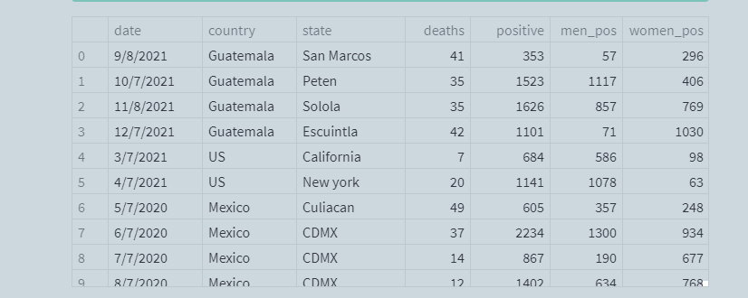
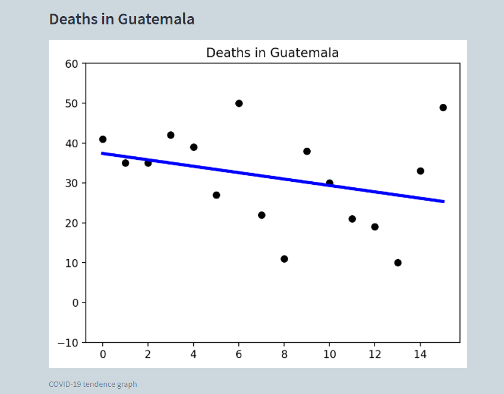
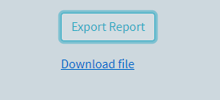

# Proyecto2 OLC2 VACDIC2021

## Datos del estudiante

JUAN ANTONIO SOLARES SAMAYOA
 
CARNET 201800496

# MANUAL USUARIO

## Descripción del problema

La pandemia del COVID-19 sin duda alguna ha causado un cambio significativo en la vida de todas las personas **alrededor** del mundo debido a los cambios drásticos que vinieron junto a está pandemia.

Debido a esto, desde el año 2020, han ocurrido muchos sucesos relacionados a la pandemia que han afectado l

A lo largo del tiempo, gracias a los avances tecnologicos se ha podido recabar una gran cantidad de datos y estadisticas  los cuales son muy necesarios para poder tomar decisiones para poder contener el avance de la pandemia y poder responder de la mejor forma para evitar muchos contagios.

## Solución
La solución propuesta es realizar una aplicacíón web en la cual se puedan analizar datos estadisticos de la pandemia a lo largo del tiempo, utilizando Ciencia de Datos. La Ciancia de Datos es una campo interdisciplinario que incolucra metodos cientificos, procesos y sistemas para poder extraer datos y conocimientos para poder tomar decisiones.

## Breve descripción de la aplicación
La aplicación consiste en un analizador de archivos .CSV, JSON y XLS los cuales contienen datos recopilados de distintas fuetes, y la aplicación tiene la capacidad (por medio de SciKit learn) de generar graficas de tendencia así como generar predicciones y gráficas de tendencia. 

## Reportes solicitados
1. Tendencia de la infección por Covid-19 en un País.
2. Predicción de Infertados en un País.
3. Indice de Progresión de la pandemia.
4. Predicción de mortalidad por COVID en un Departamento.
5. Predicción de mortalidad por COVID en un País.
6. Análisis del número de muertes por coronavirus en un País.
7. Tendencia del número de infectados por día de un País.
8. Predicción de casos de un país para un año.
9. Tendencia de la vacunación de en un País.
10. Ánalisis Comparativo de Vacunación entre 2 paises.
11. Porcentaje de hombres infectados por covid-19 en un País desde el primer caso activo -> 11
12. Ánalisis Comparativo entres 2 o más paises o continentes.
13. Muertes promedio por casos confirmados y edad de covid 19 en un País.
14. Muertes según regiones de un país - Covid 19.
15. Tendencia de casos confirmados de Coronavirus en un departamento de un País.
16. Porcentaje de muertes frente al total de casos en un país, región o continente.
17. Tasa de comportamiento de casos activos en relación al número de muertes en un continente.
18. Comportamiento y clasificación de personas infectadas por COVID-19 por municipio en un País.
19. Predicción de muertes en el último día del primer año de infecciones en un país.
20. Tasa de crecimiento de casos de COVID-19 en relación con nuevos casos diarios y tasa de muerte por COVID-19
21. Predicciones de casos y muertes en todo el mundo - Neural Network MLPRegressor
22. Tasa de mortalidad por coronavirus (COVID-19) en un país.
23. Factores de muerte por COVID-19 en un país.
24. Comparación entre el número de casos detectados y el número de pruebas de un país.
25. Predicción de casos confirmados por día

## Tecnologías utilizadas en la aplicación
La aplicación está desarrollada en el lenguaje de programación Python. Fue utilizado el framework **STREAMLIT** el cual es una framework el cual está pensado en aplicaciones de data science y tambien cuenta con una interfaz dinámica e intuitiva, asi como componentes nativos que simplifican mucho la labor del desarrollador, dedicandose unicamente a resolver el problema.

Para la parte de analisis de datos fue utilizada la librería SciKit-Learn el cual es muy util para analizar datos así como tambien generar predicciones y tendencias de variables numericas en el tiempo.

## Funciones de la aplicación

:green_book:[Pantalla Inicio](#tag1)

:green_book:[Sidebar](#tag2)

:green_book:[Reportes](#tag3)

:green_book:[Graficas](#tag4)

:green_book:[Sección de reportes](#tag5)

:green_book:[Referencias](#tag6)

# Componentes de la aplicación
## :beginner: Pantalla Inicio

## :beginner: Sidebar
El sidebar es una importante de la aplicación, ya que permite que accedamos a los controles mas basicos, ya que tambien podemos tener el control del tipo de reportes que se mostrarán.
 
 

# Flujo de la aplicación
El flujo de funcionamiento de la aplicación es el siguiente: 

1. Se carga el archivo de entrada en cualquier formato.

2. Se muestran los datos del archivo cargados en la interfaz

3. Se parametrizan los campos de del dataframe, para que posteriormente pueda realizar el analisis de los datos obtenidos, como predicciones y graficos de tendencia

4. Luego de haber preparado y filtrado las columnas del datraframe se procede a generar la grafica de acuerdo a los campos y condiciones dadas.

5. La aplicación cuenta con una opción para generar la predicción y grafico de tendencia, en formato PDF.

6. Una vez descargado el reporte PDF, se procede a visualizarlo en el navegador
   
.

# Referencias

* https://scikit-learn.org/stable/
* https://streamlit.io/